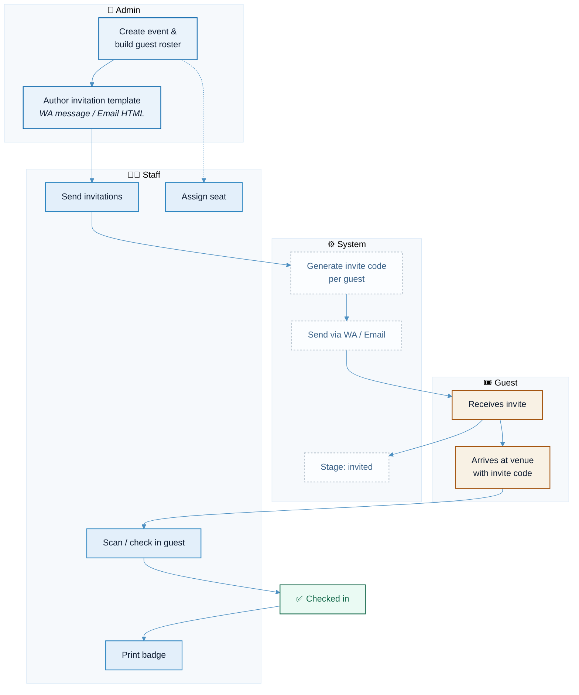
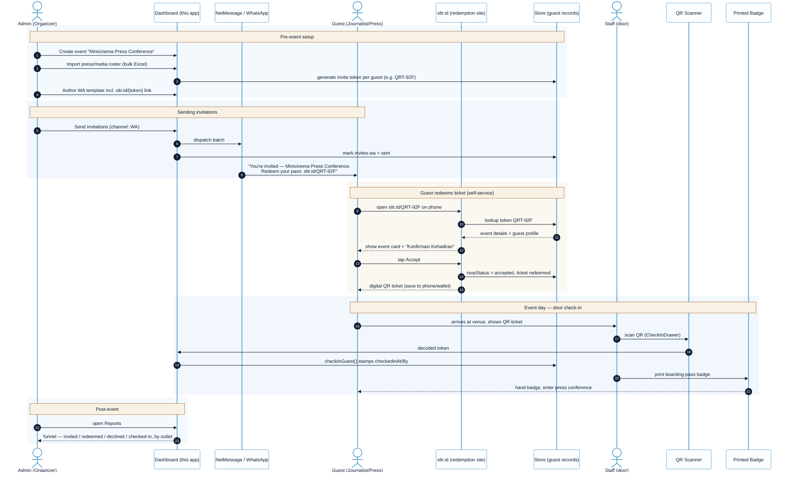

# RSVP & Check-in Flow

Reflects the actual codebase: this app has no guest-facing RSVP page — invitations go out
one-way (WhatsApp/NetMessage or Email) and the loop closes physically at the door via staff
check-in. `rsvpStatus` exists on `Guest` but is vestigial (no real flow writes it).

Stages used across the UI: `not_invited → invited → checked_in` (`getGuestStage`,
`src/data/selectors.ts`).

## End-to-end scenario — Minicinema Press Conference

Real-case walkthrough for one event, full ecosystem: admin → messaging provider →
journalist's phone → ticket redemption → door check-in → badge → post-event reporting.

> **Scope note:** the invite-send, check-in, seat-assign and report steps are the real,
> implemented flow (`SendInvitationsDrawer`, `CheckInDrawer`, `checkin.ts`, `ReportsView`).
> The **sltr.id redemption microsite** (guest self-service RSVP + digital ticket) is not in
> this codebase today — it's drawn here as the target/real-world flow this diagram was asked
> to model, since it's the piece that actually closes the loop between "invite sent" and
> "guest shows up with a valid ticket." Treat that lane as proposed, everything else as built.

## Actors

| Actor | Role in flow |
|---|---|
| **Admin** | Creates event, builds roster, authors invite templates, sets staff permissions |
| **Staff** | Sends invites, assigns seats, runs door check-in (scan/search → confirm → print) |
| **Guest / Invitee** | Passive record — receives invite, shows up with invite code, never replies electronically |
| **System** | Local-only (`localStorage`); generates codes, stamps invite/check-in status; NetMessage & Mailgun are config stubs, not live integrations |

## Notes
- No guest ever RSVPs "yes/no" back into the system — `rsvpStatus` (`accepted/unsure/declined`) is unused by any real flow.
- Seat assignment and invitation sending are independent tracks that only converge at the door: check-in requires a seat, not necessarily a prior invite (walk-ins are flagged informationally via `wasWalkIn`).
- Check-in is idempotent — `checkInGuest()` no-ops if `checkedInAt` is already set.
